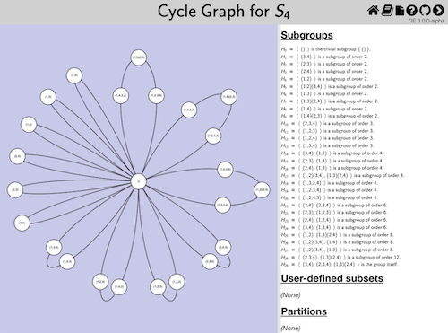

# Group Explorer GAP Package

This package allows [GAP](http://www.gap-system.org) users to create
visualizations of groups using [Group Explorer
3.0](https://nathancarter.github.io/group-explorer/index.html).

## Status

This project is approaching a first release, but still functions only
on the hard drive of the developer, because some paths are hard-coded.
Full release coming soon.

## Examples

Load the package (right now using this code, since it's not yet
technically a package).

```gap
Read( "groupexplorer.g" );
```

Visualize a group of order 16 using a Cayley graph.

```gap
ExploreCayleyGraph( SmallGroup( 16, 3 ) );
```


Visualize the group of order 5 using a multiplication table,
specifying the names of the elements.

```gap
ExploreMultiplicationTable( Group( [ (1,2,3,4,5) ] ), rec(
    representations := [
        [ "e", "a", "aa", "aaa", "aaaa" ]
    ]
) );
```


Visualize a symmetric group using a cycle graph and its
standard permutation notation as its representation.
In this example, we give the group a name, which is used in
the page heading.  We can use MathML formatting, but doing
so is optiona; plain text is also accepted.

```gap
ExploreCycleGraph( Group( [ (1,2,3,4), (1,2) ] ), rec(
    representations := PrintString,
    name := "<msub><mi>S</mi><mn>4</mn></msub>"
) );
```


